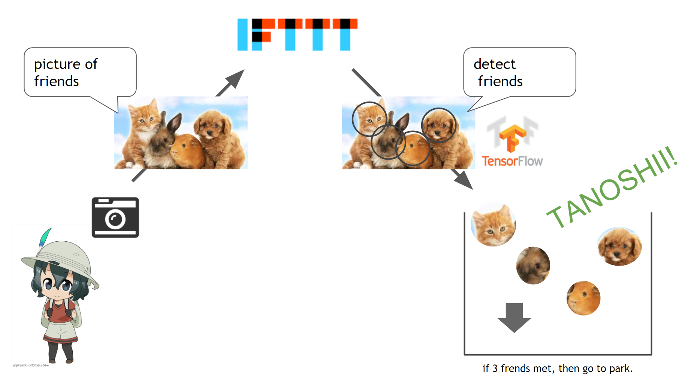

# kemono_panel

Take kemono pictures and lines up, then tanoshii

## Architecture

1. Take picture on your mobile phone etc.
2. Then [IFTTT](https://ifttt.com/discover) sends it to `kemono_puyo` server.
3. `kemono_puyo` detect friends in the picture by [`tensorflow-models/object_detection`](https://github.com/tensorflow/models/tree/master/research/object_detection)
4. Crop the friends faces.
5. Render friends by [Matter.js](http://brm.io/matter-js/)
6. Play friends voice by [HTML5 Audio](https://www.w3schools.com/html/html5_audio.asp)
7. If 3 friends met, they go to park. It is TANOSHII!

Technical Elements summary

* [IFTTT](https://ifttt.com/discover)
* [`tensorflow-models/object_detection`](https://github.com/tensorflow/models/tree/master/research/object_detection)
* [Matter.js](http://brm.io/matter-js/)
* [HTML5 Audio](https://www.w3schools.com/html/html5_audio.asp)

## Setup

1. git clone `tensorflow/models` on root directory, and make environment to setup it according to the [installation guide](https://github.com/tensorflow/models/blob/master/research/object_detection/g3doc/installation.md).
2. [Download the model weights](http://download.tensorflow.org/models/object_detection/ssd_mobilenet_v1_coco_11_06_2017.tar.gz) to `model_weights` folder and expand it.
3. [Download the label file](https://github.com/tensorflow/models/blob/master/research/object_detection/data/mscoco_label_map.pbtxt) to the same folder (`model_weights/ssd_mobilenet_v1_coco_11_06_2017`).
4. Execute `python run_server.py`

If you want connect mobile phone and `kemono_puyo` server, you have to use IFTTT. If requires global ip, [`ngrok`](https://ngrok.com/) will help you.

The `kemono_puyo` supports websocket, so anyone can participate in it (No Nokemono). Let's take photo for lonely friends!

